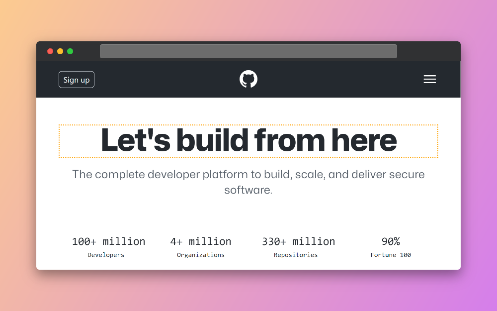
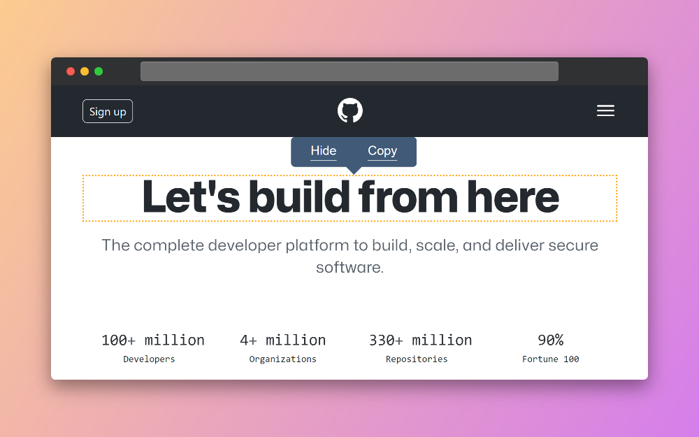
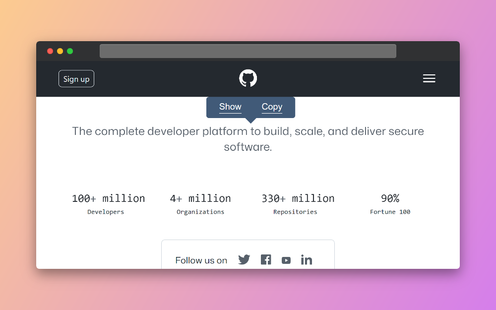
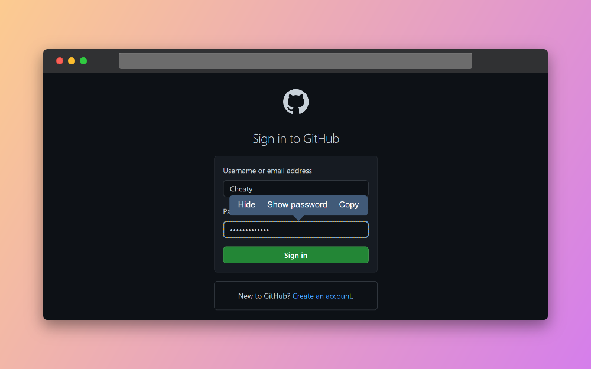
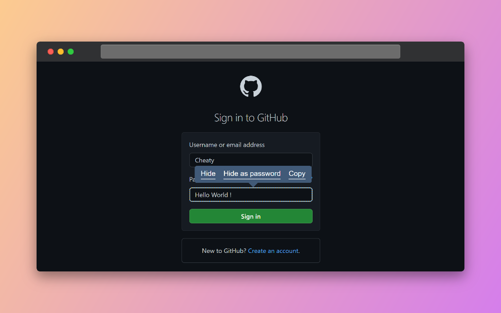

<a name="readme-top"></a>

<br />
<div align="center">
  <a href="https://github.com/NicolasRenault/cheaty-webextention">
    
  </a>

  <h3 align="center">Cheaty</h3>

  <p align="center">
    Extention for the web that feels illegal
    <br />
    <a href="https://cheaty.nicolasrenault.com">View Demo</a>
    ·
    <a href="https://cheaty.nicolasrenault.com/#download">Download</a>
    ·
    <a href="https://github.com/NicolasRenault/cheaty-webextention/issues/new">Report Bug</a>
    ·
    <a href="https://github.com/NicolasRenault/cheaty-webextention/issues/new">Request Feature</a>
  </p>
</div>
<br />

## About

Cheaty is a simple open-source web extension that allows you to do quick actions on HTML components without going into the inspector console.

With Cheaty you can:

-   Hide or display an HTML component on the page.
-   Switch a text input between text and password type.
-   Copy the outer HTML of an HTML component <sup><a href="https://developer.mozilla.org/fr/docs/Web/API/Element/outerHTML">?</a></sup>

## Getting Started

### Installation

Install the extension [here](https://cheaty.nicolasrenault.com/#download) and make sure to enable it in your browser's settings. **Be careful, the extension is not meant to work on mobile devices!**

### Starting the process

You can start using the extension by using this shortcut:

```shell
Ctrl + Alt + N
```

This will enable the **Selection mode**, change your cursor and add a border around the current hovered HTML component.



Noticed that all your keys will be disabled while you're in this mode. Press **Escape** to leave it.

### Use the extension

Once you are in **Selection mode**, you can pick the HTML component you want by hovering it with your mouse or using the arrow keys.
<br/>
Select the component by **clicking** on it or by pressing the **Enter** key. You have now enabled the **Action mode** and a menu appeared next to your selected HTML component. To go back to **Selection Mode** press **Escape**. _(Press **Escape** twice to stop the extension)_.



You have 2 buttons that allows you to **Copy** the outerHTML<sup><a href="https://developer.mozilla.org/fr/docs/Web/API/Element/outerHTML">?</a></sup> of your component or to **Hide** it from the page.



You can click on **Show** to make the HTLM component reappear.

### Passwords

When selecting an **input text**<sup><a href="https://developer.mozilla.org/fr/docs/Web/HTML/Element/input">?</a></sup> you have a new button in the action menu that allows you to **Hide/Show** the password.



_When the input is a password_



_You can as well switch back to password_

Here is the list of all the working input:

-   text
-   email
-   password
-   search
-   tel
-   url

### Popup

### Inspector Mode

## Contributing

<!-- >This section is strongly inspired by https://github.com/tonybaloney/vscode-pets/edit/master/docs/source/contributing.rst<-->

### Ideas and discussions

Have an awesome idea for a new feature? Please [open an issue](https://github.com/NicolasRenault/cheaty-webextention/issues/new) describing your idea!

### Reporting bugs

Something is not working as it should? Please [open an issue](https://github.com/NicolasRenault/cheaty-webextention/issues/new) giving as much information as you can.

-   Title - Clearly summarize what the bug is with specific details.
-   Summary - If the title is too long, include a summary with additional details.
-   Visual/Screenshot - A picture is always worth the time. Include one if possible.
-   Expected/Actual Results - Explain what you expected to happen and what actually happened.
-   Steps to Reproduce - The steps to follow should be comprehensive, easy to understand, and short. We want to experience the bug first-hand.

### Fixing an issue

Since this project is open-source, you can also help by reviewing some of the [existing issues](https://github.com/NicolasRenault/cheaty-webextention/issues). Please make sure you have the [prettier extension](https://prettier.io/https://prettier.io/) installed on your IDE.

## Contact

Nicolas Renault - [Website](https://nicolasrenault.com) - [Github](https://github.com/NicolasRenault)

Project Link: [https://github.com/NicolasRenault/cheaty-webextention](https://github.com/NicolasRenault/cheaty-webextention)

## Resources

-   [Web Extensions](https://developer.mozilla.org/fr/docs/Mozilla/Add-ons/WebExtensions)
